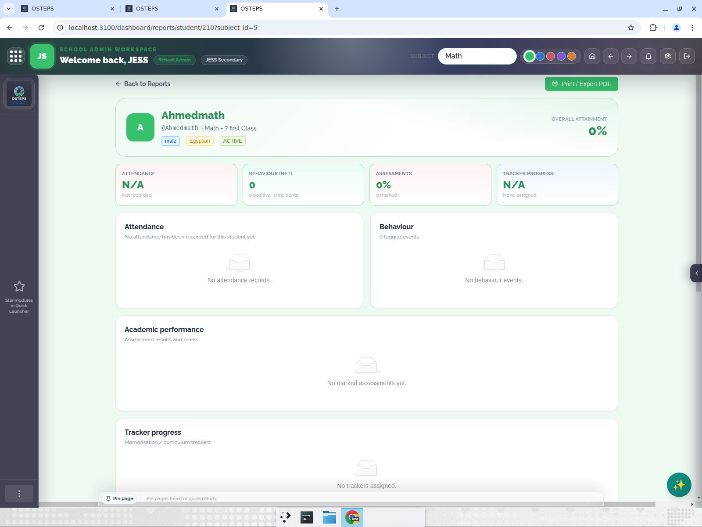
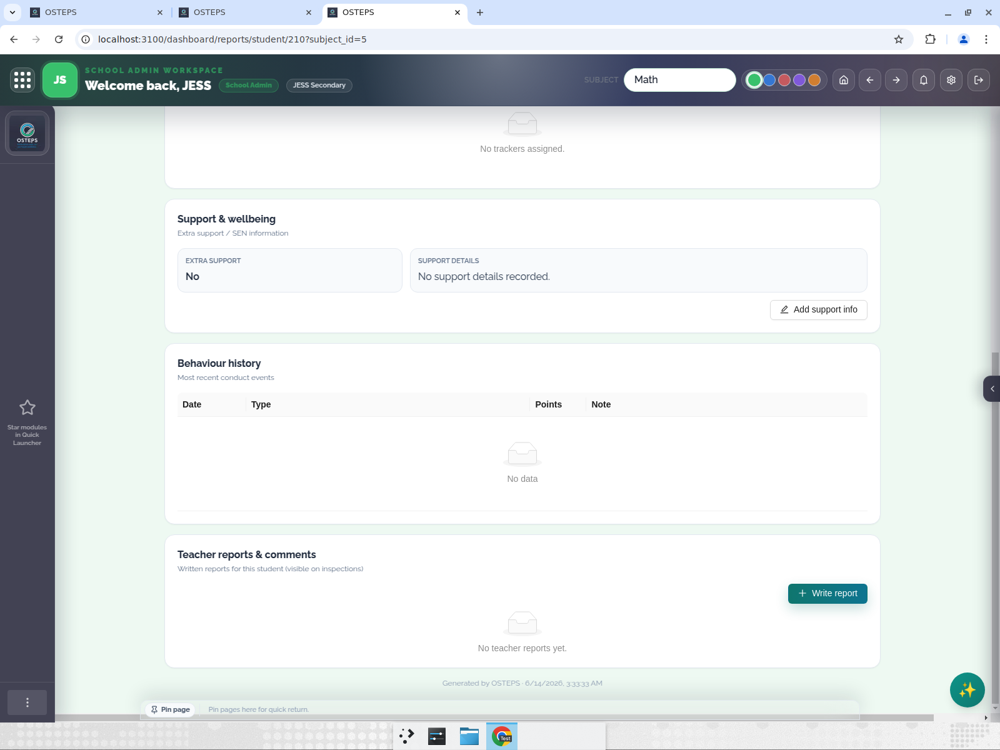
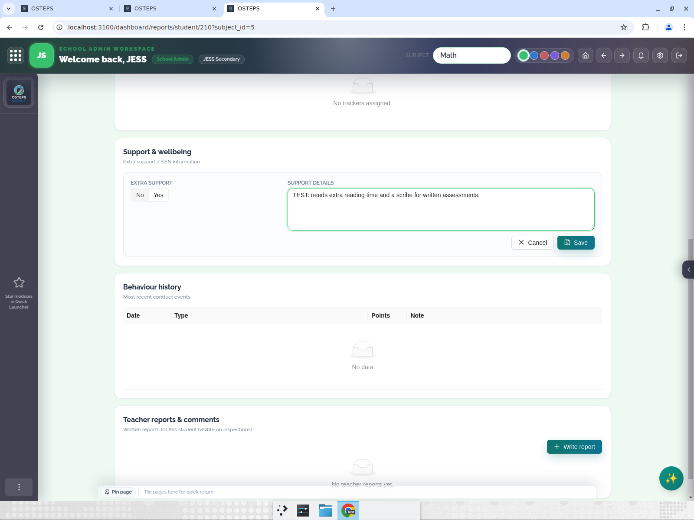

# Test Report — Editable Support & wellbeing (SEN) in Student Report

**PR:** https://github.com/menempiq77/Osteps/pull/223
**Tested:** prod build on localhost:3100 (hits live API at dashboard.osteps.com/api), logged in as JESS School Admin
**Student:** Ahmedmath (id 210), Math · 7 first Class
**Result:** 4/4 passed. Student restored to original state afterwards (no test data left).

---

## Bug found & fixed during testing

Opening a student report directly (`/dashboard/reports/student/210`) redirected to the **subject dashboard** instead of the report.

Root cause: the client-side routing table `src/lib/subjectRouting.ts` was missing `reports`, so `SubjectContext` treated the report URL as subject-scoped and repeatedly stripped path segments (`reports/student/210` → `student/210` → `210`), landing on `/dashboard/s/5/210`. This is the client-side analog of the earlier middleware fix (#221). Fixed by mirroring `middleware.ts`: added `/dashboard/reports` to `SHARED_PREFIXES` and `reports` to `SUBJECT_ROUTE_ROOTS`.

After the fix, the report loads correctly:

---

## Test 1 — Report opens at the shared route (PASS)
Report renders all sections including Support & wellbeing with an **Add support info** button (admin role → can edit).

## Test 2 — Admin can add support info (PASS)
Clicking **Add support info** opens the editor. Toggling **Extra support → Yes** enables the details textarea; entered details and clicked **Save**.

After save, display shows **Extra support: Yes** + details, the header gains an **Extra support (SEN)** tag, and the button becomes **Edit support info**.

## Test 3 — Persists across hard reload (PASS)
After Ctrl+Shift+R the Yes flag and details remain (saved to the student record via `POST /update-student-support/210`).

## Test 4 — Toggling back to No clears details (PASS)
Editing again, toggling to **No** and saving clears the details ("No support details recorded.") and removes the SEN header tag. This also restored Ahmedmath to original state.

