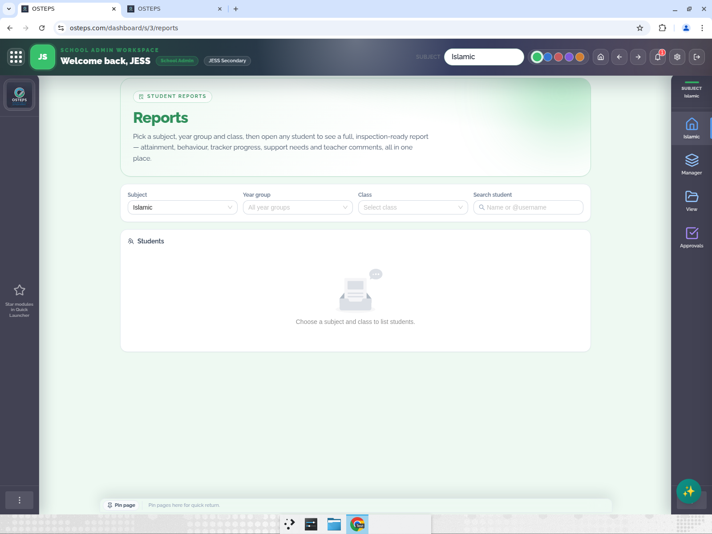
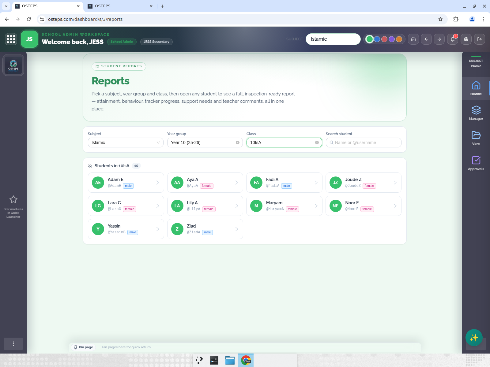
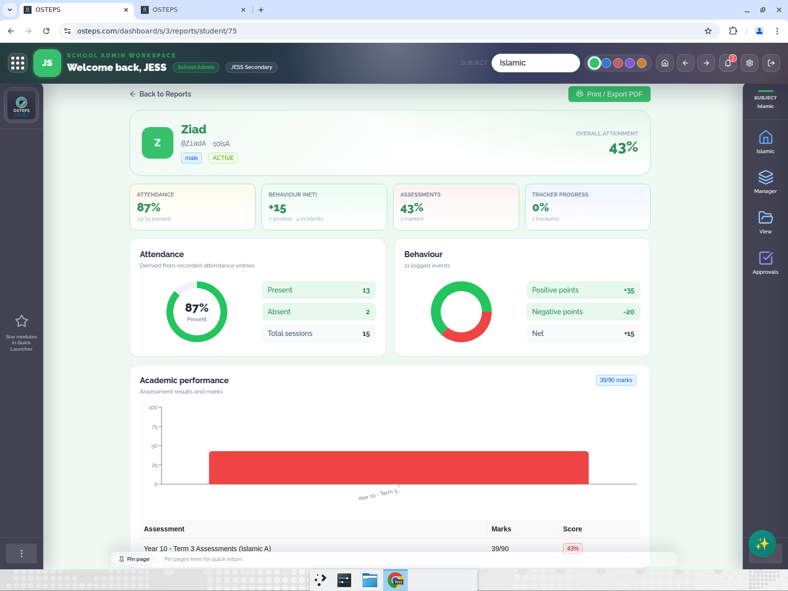
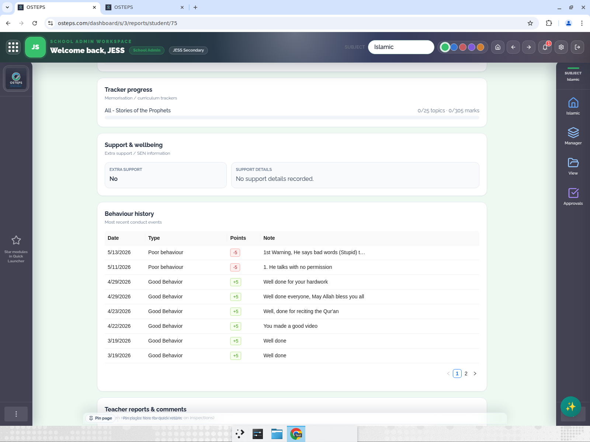
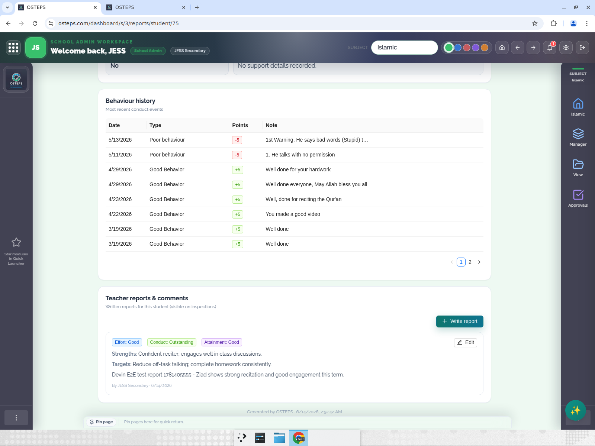
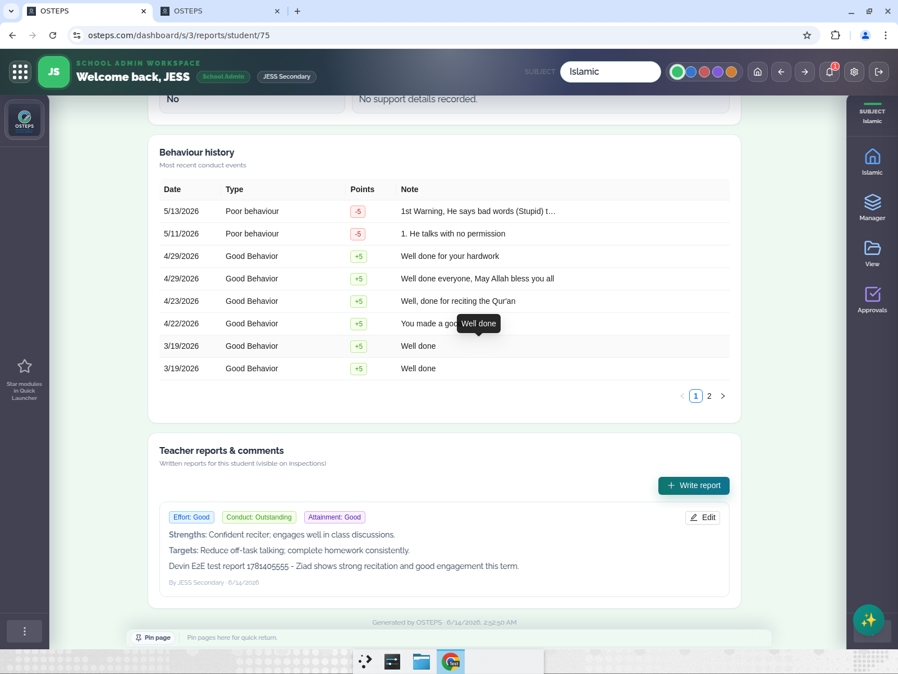
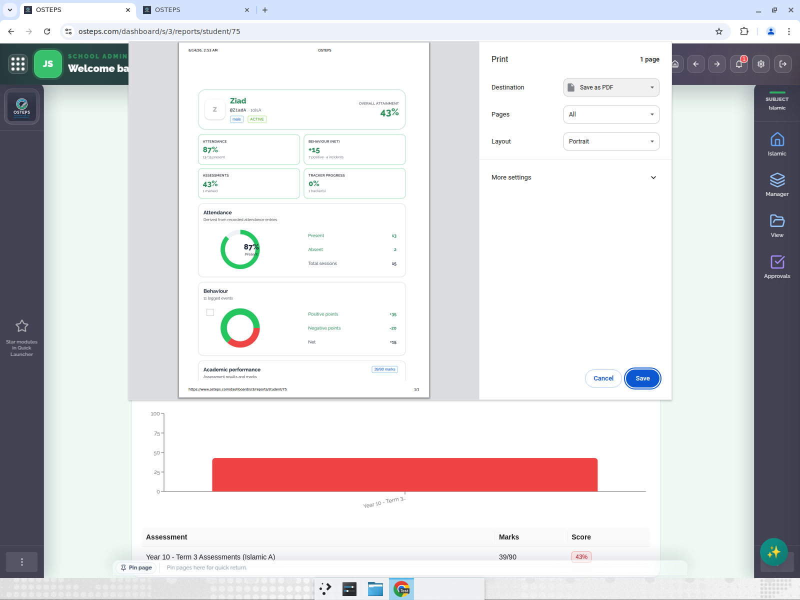

# Test Report — Student Reports feature (PR #220 + route fix #221)

**Tested on:** production www.osteps.com, logged in as JESS School Admin.
**Method:** End-to-end UI walk on the live deployed build (Reports card → filter Subject/Year/Class → open student → full report → write a teacher report → hard reload → print preview). Recorded with annotations.
**Demo student:** Ziad (id 75), class 10IsA, Year 10 (25-26), subject Islamic — chosen for rich data (assessments, 26 behaviour events, 15 attendance records, 1 assigned tracker).

## Result: 5/5 passed

| # | Test | Result |
|---|------|--------|
| 1 | Reports card opens the filter page | passed |
| 2 | Filter chain (Subject/Year/Class) lists the right students | passed |
| 3 | Full report renders with real data | passed |
| 4 | Teacher report writes + persists after reload | passed |
| 5 | Print/Export shows only report content | passed |

Note: this also confirms route fix #221 — before the fix, the Reports card redirected to the Islamic subject dashboard. The page now renders correctly (URL is the subject-scoped `/dashboard/s/3/reports`, which rewrites to the Reports page and displays the right content).

---

## Test 1 — Reports card opens the filter page (passed)
Filter page renders with hero "Reports", "Student Reports" eyebrow, Subject (pre-filled Islamic), Year group, Class, and Search filters, plus the empty state.

## Test 2 — Filter chain lists the right students (passed)
Subject = Islamic, Year group = Year 10 (25-26), Class = 10IsA → grid of 10 students, each with initials avatar, name, @username, and gender tag. Ziad present.

## Test 3 — Full report renders with real data (passed)
Header: Ziad, @ZiadA · 10IsA, male, ACTIVE, Overall attainment 43%.
KPI tiles: Attendance 87% (13/15 present), Behaviour net +15 (7 positive · 4 incidents), Assessments 43% (1 marked), Tracker progress 0% (1 tracker).
Attendance donut: Present 13 / Absent 2 / Total 15 (matches the 15 DB attendance rows). Behaviour pie: +35 positive, −20 negative, net +15. Academic bar + table: "Year 10 - Term 3 Assessments (Islamic A)" 39/90 = 43%.

Lower sections: Tracker (All - Stories of the Prophets, 0/25 topics · 0/305 marks), Support & wellbeing (Extra support: No), Behaviour history table (real conduct events with dates/points/notes).

## Test 4 — Teacher report writes + persists (passed)
Wrote a report: Effort = Good, Conduct = Outstanding, Attainment = Good, Strengths, Targets, and a unique comment ("Devin E2E test report 1781405555 …"). Saved — card rendered immediately with all ratings + text + "By JESS Secondary · 6/14/2026".

After a hard reload (Ctrl+Shift+R) the saved report still shows with the exact ratings, Strengths/Targets/comment text, and author/date — confirms backend persistence.

## Test 5 — Print/Export shows only report content (passed)
Print preview shows only the report (OSTEPS header, date, KPIs, attendance donut, behaviour pie, academic chart, URL footer). No dashboard sidebar, no topbar, no Back/Print action buttons.

---

## Notes / out of scope
- Attendance is derived from existing "Attendance Present/Absent" behaviour records (no separate attendance module). Ziad has real data so it shows a true 87%; students without those entries would show "not recorded".
- The teacher test report was left on Ziad's record (harmless; visible via the Edit control). Can be removed on request.
- Only one rich path (Islamic/Year 10/10IsA/Ziad) was exercised; other subjects/classes were not separately tested.
